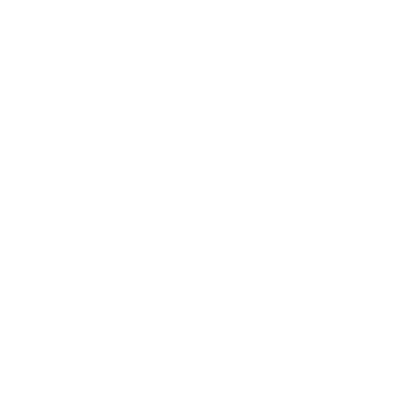

GUI Elements
============

This section provides an overview of the various graphical user interface (GUI) elements available in
the framework. Each element is described with its properties, methods, and usage examples. The idea is that
SpyDE is meant to be very easily extensible with little to no understanding of things like Qt or styling. That
doesn't mean that you __have__ to use the styling options provided and we encourage you to create your own widgets or
actions.  In doing so that can help contribute to the ecosystem of SpyDE and improve the experience for everyone!

Toolbars
~~~~~~~~
Toolbars provide quick access to commonly used actions and tools within the application. Each `Plot` has an
associated toolbar that can be customized with different buttons and controls. Each plot has 4 toolbars:
- Top Toolbar
- Bottom Toolbar
- Left Toolbar
- Right Toolbar

Each toolbar is initialized when the `Plot` becomes the active plot in the application. The actions available
in the toolbar are decided by the toolbars.yaml file. This can also be customized using extensions
(Not yet implemented).

Plot Control Dock
~~~~~~~~~~~~~~~~~
The Plot Control Dock provides a centralized location for managing plot settings and configurations.
This allows users to easily adjust plot parameters, such as axis limits, color maps. The Plot Control Dock
can be hidden or shown as needed, providing a flexible and customizable user experience and moved to different
locations within the application window.

Plots
~~~~~
The `Plot` is the central element of the application, responsible for displaying data visualizations. Each `Plot`
is either a Navigation Plot or a Signal Plot.  Navigation Plots are used to navigate through datasets, while Signal
Plots are used to display specific data signals.  For a each BaseSignalTree you can toggle the navigator images and the
signal plotted. Each `Plot` has a set of different \`PlotStates\` to explore different signals in the SignalTree. You
can switch between them by toggling the |signal-tree-icon| icon in the toolbar.

